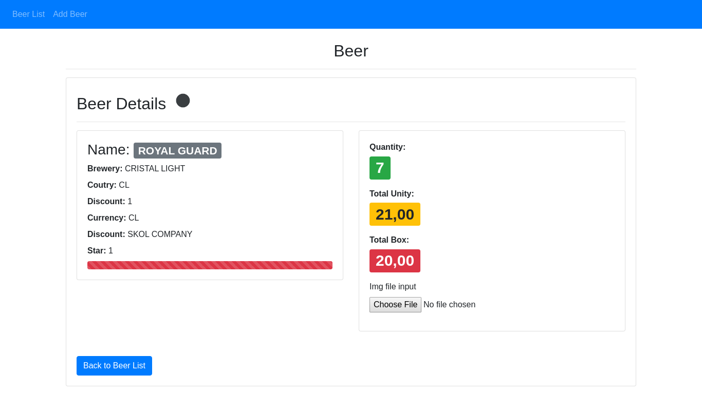
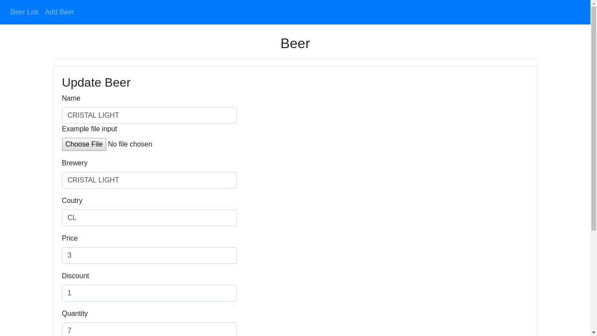

# Problema:
Bender es fanático de las cervezas y quiere tener un registro de todas las cervezas que prueba y como calcular el precio 
que necesita para comprar una caja de algún tipo especifico de cervezas. Para esto necesita una API REST con esta información
que posteriormente compartirá con sus amigos.

Descripción:
Se solicita crear un API REST basándonos en la definición que se encuentra en el archivo openapi.yaml.

Funcionalidad:
GET /Beers: Lista todas las cervezas que se encuentran en el sistema.
POST /Beers: Permite ingresar una nueva cerveza.
GET /beers/{beerID}: Lista un detalle de una cerveza especifica.
GET /beets/{beerID}/boxprice: Entrega el valor que cuesta una caja específica de cerveza dependiendo de los parámetros ingresados,
 esto quiere decir que multiplique el precio por la cantidad una vez se homologara la moneda a lo que se ingreso por parámetro.
Quantity: Cantidad de cervezas a comprar (valor por defecto 6).
Currency: Tipo de moneda con la que desea pagar, para este caso se recomienda que utilice esta API https://currencylayer.com/

Requisitos:
Puede usar alguno de los siguientes lenguajes Java, NodeJS, Go o Python. Aunque valoramos el uso de GO.
Usar Docker y Docker Compose para los diferentes servicios.
Se puede usar librarías externas y frameworks
Requisito un 70% de cobertura de código
Completa libertad para agregar nuevas funcionalidades.

Entrega:
Enviar el link del repositorio donde se realiza este ejercicio.

# Solución:

# PROYECTO 0 - FrontEnd - Angular8

# PROYECTO 1 - Java-REST-MongoDB-WebFlux

Spring Boot 
Spring WebFlux utiliza internamente Project Reactor y sus implementaciones de editor: Flux y Mono.
El nuevo marco admite dos modelos de programación: Componentes reactivos basados en anotaciones
Enrutamiento y manejo funcional MongoDB.

    //Lista todas las cervezas
	//Lista todas las cervezas que se encuentran en la base de datos
	 http://localhost:8080/beers/v1/todos

    //Lista el detalle de la marca de cervezas
	//Obtiene el precio de una caja de cerveza por su Id
	http://localhost:8080/beers/v1/id/{id}

	//Lista el detalle de la marca de cervezas por name
	http://localhost:8080/beers/v1/name/{name}

    //Lista el detalle de la marca de cervezas por brewery
	http://localhost:8080/beers/v1/brewery/{brewery}"

    ///Lista el detalle de la marca de cervezas por probar
	http://localhost:8080/beers/v1/probar/{probar}

    //Lista el detalle de la marca de cervezas por star
	http://localhost:8080/beers/v1/star/{star}

    //Lista el detalle de la marca de cervezas por coutry
	http://localhost:8080/beers/v1/coutry/{coutry}

    //Lista el precio de una caja de cervezas de una marca
	//Obtiene el precio de una caja de cerveza por su Id
	http://localhost:8080/beers/v1/{id}/boxprice

    //Ingresa una nueva cerveza
	http://localhost:8080/beers/v1/nuevo

    //Lista el detalle de la marca de cervezas ...events
	http://localhost:8080/beers/events

# PROYECTO 2 - NODEJS-REST-MongoDB
    //Lista todas las cervezas
	// Lista todas las cervezas que se encuentran en la base de datos
	 http://localhost:8080/beers/v1/todos

# PROYECTO 3 - Go-REST-MongoDB

:-)

